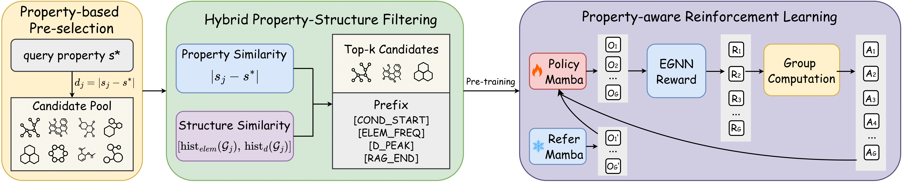

# Property-aware Reinforcement Learning with Retrieval Enhancement for Controllable 3D Molecule Generation

This repository implements **POETIC** based on the source code of [Geo2Seq](https://github.com/divelab/AIRS/tree/7acc5357befe7493c335fb94e34829423a6eacba/OpenMol/Geo2Seq).

Our work introduces **POETIC** (Property-aware Reinforcement Learning with Retrieval Enhancement), a novel framework for controllable 3D molecule generation. Our work unifies two complementary components:

\- **Retrieval-augmented conditioning**: retrieves property- and structure-similar molecules as compact prefixes, providing chemically meaningful context.  

\- **Property-aware reinforcement learning**: uses a frozen property predictor to deliver explicit rewards, ensuring validity and alignment with target properties.  

This design enables POETIC to achieve precise controllability on in-distribution properties while maintaining robust generalization to unseen ones. 



## Environment setup

Please refer to `enviroment_full.yml`.

## Process data

We first tokenize the QM9 dataset using Geo2Seq, which converts 3D molecular structures into SE(3)-invariant sequences and attaches property labels as generation conditions.
## QM9
```bash
python rag/process_seq.py --dataset qm9 --classifier_path qm9/property_prediction/outputs/qm9_alpha_egnn --input_path data/qm9_seq.txt --save_path data/qm9_alpha/qm9_alpha_embeddings.npz
python rag/process_seq.py --dataset qm9 --classifier_path qm9/property_prediction/outputs/qm9_gap_egnn --input_path data/qm9_seq.txt --save_path data/qm9_gap/qm9_gap_embeddings.npz
python rag/process_seq.py --dataset qm9 --classifier_path qm9/property_prediction/outputs/qm9_homo_egnn --input_path data/qm9_seq.txt --save_path data/qm9_homo/qm9_homo_embeddings.npz
python rag/process_seq.py --dataset qm9 --classifier_path qm9/property_prediction/outputs/qm9_lumo_egnn --input_path data/qm9_seq.txt --save_path data/qm9_lumo/qm9_lumo_embeddings.npz
python rag/process_seq.py --dataset qm9 --classifier_path qm9/property_prediction/outputs/qm9_mu_egnn --input_path data/qm9_seq.txt --save_path data/qm9_mu/qm9_mu_embeddings.npz
python rag/process_seq.py --dataset qm9 --classifier_path qm9/property_prediction/outputs/qm9_Cv_egnn --input_path data/qm9_seq.txt --save_path data/qm9_Cv/qm9_Cv_embeddings.npz
```

```bash
python rag/retriever.py --db_emb_path data/qm9_alpha/qm9_alpha_embeddings.npz --db_prop_path data/qm9_alpha/alpha.txt --save_path data/qm9_alpha/train_ret_alpha.npz --k_pool 100 --k_fine 10
python rag/retriever.py --db_emb_path data/qm9_gap/qm9_gap_embeddings.npz --db_prop_path data/qm9_gap/gap.txt --save_path data/qm9_gap/train_ret_gap.npz --k_pool 100 --k_fine 10
python rag/retriever.py --db_emb_path data/qm9_homo/qm9_homo_embeddings.npz --db_prop_path data/qm9_homo/homo.txt --save_path data/qm9_homo/train_ret_homo.npz --k_pool 100 --k_fine 10
python rag/retriever.py --db_emb_path data/qm9_lumo/qm9_lumo_embeddings.npz --db_prop_path data/qm9_lumo/lumo.txt --save_path data/qm9_lumo/train_ret_lumo.npz --k_pool 100 --k_fine 10
python rag/retriever.py --db_emb_path data/qm9_mu/qm9_mu_embeddings.npz --db_prop_path data/qm9_mu/mu.txt --save_path data/qm9_mu/train_ret_mu.npz --k_pool 100 --k_fine 10
python rag/retriever.py --db_emb_path data/qm9_Cv/qm9_Cv_embeddings.npz --db_prop_path data/qm9_Cv/Cv.txt --save_path data/qm9_Cv/train_ret_Cv.npz --k_pool 100 --k_fine 10
```

```bash
python rag/finetune_retriever.py --db_emb_path data/qm9_alpha/qm9_alpha_embeddings.npz --db_prop_path data/qm9_alpha/alpha.txt --prop_path data/qm9_alpha/alpha.txt --save_path data/qm9_alpha/finetune_ret_alpha.npz --k_pool 100 --k_fine 10
python rag/finetune_retriever.py --db_emb_path data/qm9_gap/qm9_gap_embeddings.npz --db_prop_path data/qm9_gap/gap.txt --prop_path data/qm9_gap/gap.txt --save_path data/qm9_gap/finetune_ret_gap.npz --k_pool 100 --k_fine 10
python rag/finetune_retriever.py --db_emb_path data/qm9_homo/qm9_homo_embeddings.npz --db_prop_path data/qm9_homo/homo.txt --prop_path data/qm9_homo/homo.txt --save_path data/qm9_homo/finetune_ret_homo.npz --k_pool 100 --k_fine 10
python rag/finetune_retriever.py --db_emb_path data/qm9_lumo/qm9_lumo_embeddings.npz --db_prop_path data/qm9_lumo/lumo.txt --prop_path data/qm9_lumo/lumo.txt --save_path data/qm9_lumo/finetune_ret_lumo.npz --k_pool 100 --k_fine 10
python rag/finetune_retriever.py --db_emb_path data/qm9_mu/qm9_mu_embeddings.npz --db_prop_path data/qm9_mu/mu.txt --prop_path data/qm9_mu/mu.txt --save_path data/qm9_mu/finetune_ret_mu.npz --k_pool 100 --k_fine 10
python rag/finetune_retriever.py --db_emb_path data/qm9_Cv/qm9_Cv_embeddings.npz --db_prop_path data/qm9_Cv/Cv.txt --prop_path data/qm9_Cv/Cv.txt --save_path data/qm9_Cv/finetune_ret_Cv.npz --k_pool 100 --k_fine 10
```

```bash
python sample.py --prop_path data/qm9_alpha/alpha.txt --save_path data/qm9_alpha/sampled_alpha.txt --num_samples 10000 --num_bins 1000 --seed 3407
python sample.py --prop_path data/qm9_gap/gap.txt --save_path data/qm9_gap/sampled_gap.txt --num_samples 10000 --num_bins 1000 --seed 3407
python sample.py --prop_path data/qm9_homo/homo.txt --save_path data/qm9_homo/sampled_homo.txt --num_samples 10000 --num_bins 1000 --seed 3407
python sample.py --prop_path data/qm9_lumo/lumo.txt --save_path data/qm9_lumo/sampled_lumo.txt --num_samples 10000 --num_bins 1000 --seed 3407
python sample.py --prop_path data/qm9_mu/mu.txt --save_path data/qm9_mu/sampled_mu.txt --num_samples 10000 --num_bins 1000 --seed 3407
python sample.py --prop_path data/qm9_Cv/Cv.txt --save_path data/qm9_Cv/sampled_Cv.txt --num_samples 10000 --num_bins 1000 --seed 3407
```

```bash
python rag/test_retriever.py --db_emb_path data/qm9_alpha/qm9_alpha_embeddings.npz --db_prop_path data/qm9_alpha/alpha.txt --query_prop_path data/qm9_alpha/sampled_alpha.txt --save_path data/qm9_alpha/test_ret_alpha.npz --k_pool 100 --k_fine 10
python rag/test_retriever.py --db_emb_path data/qm9_gap/qm9_gap_embeddings.npz --db_prop_path data/qm9_gap/gap.txt --query_prop_path data/qm9_gap/sampled_gap.txt --save_path data/qm9_gap/test_ret_gap.npz --k_pool 100 --k_fine 10
python rag/test_retriever.py --db_emb_path data/qm9_homo/qm9_homo_embeddings.npz --db_prop_path data/qm9_homo/homo.txt --query_prop_path data/qm9_homo/sampled_homo.txt --save_path data/qm9_homo/test_ret_homo.npz --k_pool 100 --k_fine 10
python rag/test_retriever.py --db_emb_path data/qm9_lumo/qm9_lumo_embeddings.npz --db_prop_path data/qm9_lumo/lumo.txt --query_prop_path data/qm9_lumo/sampled_lumo.txt --save_path data/qm9_lumo/test_ret_lumo.npz --k_pool 100 --k_fine 10
python rag/test_retriever.py --db_emb_path data/qm9_mu/qm9_mu_embeddings.npz --db_prop_path data/qm9_mu/mu.txt --query_prop_path data/qm9_mu/sampled_mu.txt --save_path data/qm9_mu/test_ret_mu.npz --k_pool 100 --k_fine 10
python rag/test_retriever.py --db_emb_path data/qm9_Cv/qm9_Cv_embeddings.npz --db_prop_path data/qm9_Cv/Cv.txt --query_prop_path data/qm9_Cv/sampled_Cv.txt --save_path data/qm9_Cv/test_ret_Cv.npz --k_pool 100 --k_fine 10
```

```bash
python train.py --run_name conditional_qm9 --prop alpha --model poetic --root_path ./data/qm9_seq.txt --prop_path ./data/qm9_alpha/alpha.txt --db_emb_path ./data/qm9_alpha/qm9_alpha_embeddings.npz --db_prop_path ./data/qm9_alpha/alpha.txt --retrieval_path data/qm9_alpha/train_ret_alpha.npz --tokenizer_dir ./data/qm9_tokenizer/alpha --batch_size 160 --learning_rate 6e-4 --max_epochs 200 --num_workers 8 --max_len 128 --save_path cond/qm9/alpha_weights/conditional_qm9.pt
python train.py --run_name conditional_qm9 --prop gap --model poetic --root_path ./data/qm9_seq.txt --prop_path ./data/qm9_gap/gap.txt --db_emb_path ./data/qm9_gap/qm9_gap_embeddings.npz --db_prop_path ./data/qm9_gap/gap.txt --retrieval_path data/qm9_gap/train_ret_gap.npz --tokenizer_dir ./data/qm9_tokenizer/gap --batch_size 160 --learning_rate 6e-4 --max_epochs 200 --num_workers 8 --max_len 128 --save_path cond/qm9/gap_weights/conditional_qm9.pt
python train.py --run_name conditional_qm9 --prop homo --model poetic --root_path ./data/qm9_seq.txt --prop_path ./data/qm9_homo/homo.txt --db_emb_path ./data/qm9_homo/qm9_homo_embeddings.npz --db_prop_path ./data/qm9_homo/homo.txt --retrieval_path data/qm9_homo/train_ret_homo.npz --tokenizer_dir ./data/qm9_tokenizer/homo --batch_size 160 --learning_rate 6e-4 --max_epochs 200 --num_workers 8 --max_len 128 --save_path cond/qm9/homo_weights/conditional_qm9.pt
python train.py --run_name conditional_qm9 --prop lumo --model poetic --root_path ./data/qm9_seq.txt --prop_path ./data/qm9_lumo/lumo.txt --db_emb_path ./data/qm9_lumo/qm9_lumo_embeddings.npz --db_prop_path ./data/qm9_lumo/lumo.txt --retrieval_path data/qm9_lumo/train_ret_lumo.npz --tokenizer_dir ./data/qm9_tokenizer/lumo --batch_size 160 --learning_rate 6e-4 --max_epochs 200 --num_workers 8 --max_len 128 --save_path cond/qm9/lumo_weights/conditional_qm9.pt
python train.py --run_name conditional_qm9 --prop mu --model poetic --root_path ./data/qm9_seq.txt --prop_path ./data/qm9_mu/mu.txt --db_emb_path ./data/qm9_mu/qm9_mu_embeddings.npz --db_prop_path ./data/qm9_mu/mu.txt --retrieval_path data/qm9_mu/train_ret_mu.npz --tokenizer_dir ./data/qm9_tokenizer/mu --batch_size 160 --learning_rate 6e-4 --max_epochs 200 --num_workers 8 --max_len 128 --save_path cond/qm9/mu_weights/conditional_qm9.pt
python train.py --run_name conditional_qm9 --prop Cv --model poetic --root_path ./data/qm9_seq.txt --prop_path ./data/qm9_Cv/Cv.txt --db_emb_path ./data/qm9_Cv/qm9_Cv_embeddings.npz --db_prop_path ./data/qm9_Cv/Cv.txt --retrieval_path data/qm9_Cv/train_ret_Cv.npz --tokenizer_dir ./data/qm9_tokenizer/Cv --batch_size 160 --learning_rate 6e-4 --max_epochs 200 --num_workers 8 --max_len 128 --save_path cond/qm9/Cv_weights/conditional_qm9.pt
```

```bash
python grpo_finetune.py --run_name finetune_qm9 --dataset qm9 --sft_ckpt ./cond/qm9/alpha_weights/conditional_qm9.pt --vocab_dir ./data/qm9_tokenizer/alpha --finetune_data_path ./data/qm9_alpha/finetune_ret_alpha.npz --prop_path ./data/qm9_alpha/alpha.txt --db_emb_path ./data/qm9_alpha/qm9_alpha_embeddings.npz --db_prop_path ./data/qm9_alpha/alpha.txt --classifier_path qm9/property_prediction/outputs/qm9_alpha_egnn --out_dir cond/qm9/alpha_weights --lr 5e-6 --save_every 500 --batch_conditions 8 --iters 500 --max_len 128 --train_smiles_path ./data/qm9_smiles.npy --novelty_weight 3.0 --kl_coeff 0.01 --temperature 1.2 --topk 100
python grpo_finetune.py --run_name finetune_qm9 --dataset qm9 --sft_ckpt ./cond/qm9/gap_weights/conditional_qm9.pt --vocab_dir ./data/qm9_tokenizer/gap --finetune_data_path ./data/qm9_gap/finetune_ret_gap.npz --prop_path ./data/qm9_gap/gap.txt --db_emb_path ./data/qm9_gap/qm9_gap_embeddings.npz --db_prop_path ./data/qm9_gap/gap.txt --classifier_path qm9/property_prediction/outputs/qm9_gap_egnn --out_dir cond/qm9/gap_weights --lr 5e-6 --save_every 500 --batch_conditions 8 --iters 500 --max_len 128 --train_smiles_path ./data/qm9_smiles.npy --novelty_weight 3.0 --kl_coeff 0.01 --temperature 1.2 --topk 100
python grpo_finetune.py --run_name finetune_qm9 --dataset qm9 --sft_ckpt ./cond/qm9/homo_weights/conditional_qm9.pt --vocab_dir ./data/qm9_tokenizer/homo --finetune_data_path ./data/qm9_homo/finetune_ret_homo.npz --prop_path ./data/qm9_homo/homo.txt --db_emb_path ./data/qm9_homo/qm9_homo_embeddings.npz --db_prop_path ./data/qm9_homo/homo.txt --classifier_path qm9/property_prediction/outputs/qm9_homo_egnn --out_dir cond/qm9/homo_weights --lr 5e-6 --save_every 500 --batch_conditions 8 --iters 500 --max_len 128 --train_smiles_path ./data/qm9_smiles.npy --novelty_weight 3.0 --kl_coeff 0.01 --temperature 1.2 --topk 100
python grpo_finetune.py --run_name finetune_qm9 --dataset qm9 --sft_ckpt ./cond/qm9/lumo_weights/conditional_qm9.pt --vocab_dir ./data/qm9_tokenizer/lumo --finetune_data_path ./data/qm9_lumo/finetune_ret_lumo.npz --prop_path ./data/qm9_lumo/lumo.txt --db_emb_path ./data/qm9_lumo/qm9_lumo_embeddings.npz --db_prop_path ./data/qm9_lumo/lumo.txt --classifier_path qm9/property_prediction/outputs/qm9_lumo_egnn --out_dir cond/qm9/lumo_weights --lr 5e-6 --save_every 500 --batch_conditions 8 --iters 500 --max_len 128 --train_smiles_path ./data/qm9_smiles.npy --novelty_weight 3.0 --kl_coeff 0.01 --temperature 1.2 --topk 100
python grpo_finetune.py --run_name finetune_qm9 --dataset qm9 --sft_ckpt ./cond/qm9/mu_weights/conditional_qm9.pt --vocab_dir ./data/qm9_tokenizer/mu --finetune_data_path ./data/qm9_mu/finetune_ret_mu.npz --prop_path ./data/qm9_mu/mu.txt --db_emb_path ./data/qm9_mu/qm9_mu_embeddings.npz --db_prop_path ./data/qm9_mu/mu.txt --classifier_path qm9/property_prediction/outputs/qm9_mu_egnn --out_dir cond/qm9/mu_weights --lr 5e-6 --save_every 500 --batch_conditions 8 --iters 500 --max_len 128 --train_smiles_path ./data/qm9_smiles.npy --novelty_weight 3.0 --kl_coeff 0.01 --temperature 1.2 --topk 100
python grpo_finetune.py --run_name finetune_qm9 --dataset qm9 --sft_ckpt ./cond/qm9/Cv_weights/conditional_qm9.pt --vocab_dir ./data/qm9_tokenizer/Cv --finetune_data_path ./data/qm9_Cv/finetune_ret_Cv.npz --prop_path ./data/qm9_Cv/Cv.txt --db_emb_path ./data/qm9_Cv/qm9_Cv_embeddings.npz --db_prop_path ./data/qm9_Cv/Cv.txt --classifier_path qm9/property_prediction/outputs/qm9_Cv_egnn --out_dir cond/qm9/Cv_weights --lr 5e-6 --save_every 500 --batch_conditions 8 --iters 500 --max_len 128 --train_smiles_path ./data/qm9_smiles.npy --novelty_weight 3.0 --kl_coeff 0.01 --temperature 1.2 --topk 100
```
```bash
python generate.py --run_name alpha --tokenizer_dir ./data/qm9_tokenizer/alpha --save_path cond/qm9/alpha_gens --target_prop_path data/qm9_alpha/sampled_alpha.txt --test_retrieval_path data/qm9_alpha/test_ret_alpha.npz --db_emb_path data/qm9_alpha/qm9_alpha_embeddings.npz --db_prop_path data/qm9_alpha/alpha.txt --temperature 1.2 --topk 100 --repeats 1 --batch_size 320 --ckpt_path cond/qm9/alpha_weights/finetune_qm9_step500.pt --max_len 128
python generate.py --run_name gap --tokenizer_dir ./data/qm9_tokenizer/gap --save_path cond/qm9/gap_gens --target_prop_path data/qm9_gap/sampled_gap.txt --test_retrieval_path data/qm9_gap/test_ret_gap.npz --db_emb_path data/qm9_gap/qm9_gap_embeddings.npz --db_prop_path data/qm9_gap/gap.txt --temperature 1.2 --topk 100 --repeats 1 --batch_size 320 --ckpt_path cond/qm9/gap_weights/finetune_qm9_step500.pt --max_len 128
python generate.py --run_name homo --tokenizer_dir ./data/qm9_tokenizer/homo --save_path cond/qm9/homo_gens --target_prop_path data/qm9_homo/sampled_homo.txt --test_retrieval_path data/qm9_homo/test_ret_homo.npz --db_emb_path data/qm9_homo/qm9_homo_embeddings.npz --db_prop_path data/qm9_homo/homo.txt --temperature 1.2 --topk 100 --repeats 1 --batch_size 320 --ckpt_path cond/qm9/homo_weights/finetune_qm9_step500.pt --max_len 128
python generate.py --run_name lumo --tokenizer_dir ./data/qm9_tokenizer/lumo --save_path cond/qm9/lumo_gens --target_prop_path data/qm9_lumo/sampled_lumo.txt --test_retrieval_path data/qm9_lumo/test_ret_lumo.npz --db_emb_path data/qm9_lumo/qm9_lumo_embeddings.npz --db_prop_path data/qm9_lumo/lumo.txt --temperature 1.2 --topk 100 --repeats 1 --batch_size 320 --ckpt_path cond/qm9/lumo_weights/finetune_qm9_step500.pt --max_len 128
python generate.py --run_name mu --tokenizer_dir ./data/qm9_tokenizer/mu --save_path cond/qm9/mu_gens --target_prop_path data/qm9_mu/sampled_mu.txt --test_retrieval_path data/qm9_mu/test_ret_mu.npz --db_emb_path data/qm9_mu/qm9_mu_embeddings.npz --db_prop_path data/qm9_mu/mu.txt --temperature 1.2 --topk 100 --repeats 1 --batch_size 320 --ckpt_path cond/qm9/mu_weights/finetune_qm9_step500.pt --max_len 128
python generate.py --run_name Cv --tokenizer_dir ./data/qm9_tokenizer/Cv --save_path cond/qm9/Cv_gens --target_prop_path data/qm9_Cv/sampled_Cv.txt --test_retrieval_path data/qm9_Cv/test_ret_Cv.npz --db_emb_path data/qm9_Cv/qm9_Cv_embeddings.npz --db_prop_path data/qm9_Cv/Cv.txt --temperature 1.2 --topk 100 --repeats 1 --batch_size 320 --ckpt_path cond/qm9/Cv_weights/finetune_qm9_step500.pt --max_len 128
```
```bash
python eval.py --generated_path cond/qm9/alpha_gens/alpha_generated.txt --target_path data/qm9_alpha/sampled_alpha.txt --classifier_path qm9/property_prediction/outputs/qm9_alpha_schnet --property alpha --train_prop_path data/qm9_alpha/alpha.txt --dataset qm9
python eval.py --generated_path cond/qm9/gap_gens/gap_generated.txt --target_path data/qm9_gap/sampled_gap.txt --classifier_path qm9/property_prediction/outputs/qm9_gap_schnet --property gap --train_prop_path data/qm9_gap/gap.txt --dataset qm9
python eval.py --generated_path cond/qm9/homo_gens/homo_generated.txt --target_path data/qm9_homo/sampled_homo.txt --classifier_path qm9/property_prediction/outputs/qm9_homo_schnet --property homo --train_prop_path data/qm9_homo/homo.txt --dataset qm9
python eval.py --generated_path cond/qm9/lumo_gens/lumo_generated.txt --target_path data/qm9_lumo/sampled_lumo.txt --classifier_path qm9/property_prediction/outputs/qm9_lumo_schnet --property lumo --train_prop_path data/qm9_lumo/lumo.txt --dataset qm9
python eval.py --generated_path cond/qm9/mu_gens/mu_generated.txt --target_path data/qm9_mu/sampled_mu.txt --classifier_path qm9/property_prediction/outputs/qm9_mu_schnet --property mu --train_prop_path data/qm9_mu/mu.txt --dataset qm9
python eval.py --generated_path cond/qm9/Cv_gens/Cv_generated.txt --target_path data/qm9_Cv/sampled_Cv.txt --classifier_path qm9/property_prediction/outputs/qm9_Cv_schnet --property Cv --train_prop_path data/qm9_Cv/Cv.txt --dataset qm9
```


## ALCHEMY
```bash
python rag/process_seq.py --dataset alchemy --classifier_path qm9/property_prediction/outputs/alchemy_alpha_egnn --input_path data/alchemy_seq.txt --save_path data/alchemy_alpha/alchemy_alpha_embeddings.npz
python rag/process_seq.py --dataset alchemy --classifier_path qm9/property_prediction/outputs/alchemy_gap_egnn --input_path data/alchemy_seq.txt --save_path data/alchemy_gap/alchemy_gap_embeddings.npz
python rag/process_seq.py --dataset alchemy --classifier_path qm9/property_prediction/outputs/alchemy_homo_egnn --input_path data/alchemy_seq.txt --save_path data/alchemy_homo/alchemy_homo_embeddings.npz
python rag/process_seq.py --dataset alchemy --classifier_path qm9/property_prediction/outputs/alchemy_lumo_egnn --input_path data/alchemy_seq.txt --save_path data/alchemy_lumo/alchemy_lumo_embeddings.npz
python rag/process_seq.py --dataset alchemy --classifier_path qm9/property_prediction/outputs/alchemy_mu_egnn --input_path data/alchemy_seq.txt --save_path data/alchemy_mu/alchemy_mu_embeddings.npz
python rag/process_seq.py --dataset alchemy --classifier_path qm9/property_prediction/outputs/alchemy_Cv_egnn --input_path data/alchemy_seq.txt --save_path data/alchemy_Cv/alchemy_Cv_embeddings.npz
```

```bash
python rag/retriever.py --db_emb_path data/alchemy_alpha/alchemy_alpha_embeddings.npz --db_prop_path data/alchemy_alpha/alpha.txt --save_path data/alchemy_alpha/train_ret_alpha.npz --k_pool 100 --k_fine 10
python rag/retriever.py --db_emb_path data/alchemy_gap/alchemy_gap_embeddings.npz --db_prop_path data/alchemy_gap/gap.txt --save_path data/alchemy_gap/train_ret_gap.npz --k_pool 100 --k_fine 10
python rag/retriever.py --db_emb_path data/alchemy_homo/alchemy_homo_embeddings.npz --db_prop_path data/alchemy_homo/homo.txt --save_path data/alchemy_homo/train_ret_homo.npz --k_pool 100 --k_fine 10
python rag/retriever.py --db_emb_path data/alchemy_lumo/alchemy_lumo_embeddings.npz --db_prop_path data/alchemy_lumo/lumo.txt --save_path data/alchemy_lumo/train_ret_lumo.npz --k_pool 100 --k_fine 10
python rag/retriever.py --db_emb_path data/alchemy_mu/alchemy_mu_embeddings.npz --db_prop_path data/alchemy_mu/mu.txt --save_path data/alchemy_mu/train_ret_mu.npz --k_pool 100 --k_fine 10
python rag/retriever.py --db_emb_path data/alchemy_Cv/alchemy_Cv_embeddings.npz --db_prop_path data/alchemy_Cv/Cv.txt --save_path data/alchemy_Cv/train_ret_Cv.npz --k_pool 100 --k_fine 10
```

```bash
python rag/finetune_retriever.py --db_emb_path data/alchemy_alpha/alchemy_alpha_embeddings.npz --db_prop_path data/alchemy_alpha/alpha.txt --prop_path data/alchemy_alpha/alpha.txt --save_path data/alchemy_alpha/finetune_ret_alpha.npz --k_pool 100 --k_fine 10
python rag/finetune_retriever.py --db_emb_path data/alchemy_gap/alchemy_gap_embeddings.npz --db_prop_path data/alchemy_gap/gap.txt --prop_path data/alchemy_gap/gap.txt --save_path data/alchemy_gap/finetune_ret_gap.npz --k_pool 100 --k_fine 10
python rag/finetune_retriever.py --db_emb_path data/alchemy_homo/alchemy_homo_embeddings.npz --db_prop_path data/alchemy_homo/homo.txt --prop_path data/alchemy_homo/homo.txt --save_path data/alchemy_homo/finetune_ret_homo.npz --k_pool 100 --k_fine 10
python rag/finetune_retriever.py --db_emb_path data/alchemy_lumo/alchemy_lumo_embeddings.npz --db_prop_path data/alchemy_lumo/lumo.txt --prop_path data/alchemy_lumo/lumo.txt --save_path data/alchemy_lumo/finetune_ret_lumo.npz --k_pool 100 --k_fine 10
python rag/finetune_retriever.py --db_emb_path data/alchemy_mu/alchemy_mu_embeddings.npz --db_prop_path data/alchemy_mu/mu.txt --prop_path data/alchemy_mu/mu.txt --save_path data/alchemy_mu/finetune_ret_mu.npz --k_pool 100 --k_fine 10
python rag/finetune_retriever.py --db_emb_path data/alchemy_Cv/alchemy_Cv_embeddings.npz --db_prop_path data/alchemy_Cv/Cv.txt --prop_path data/alchemy_Cv/Cv.txt --save_path data/alchemy_Cv/finetune_ret_Cv.npz --k_pool 100 --k_fine 10
```

```bash
python sample.py --prop_path data/alchemy_alpha/alpha.txt --save_path data/alchemy_alpha/sampled_alpha.txt --num_samples 10000 --num_bins 1000 --seed 3407
python sample.py --prop_path data/alchemy_gap/gap.txt --save_path data/alchemy_gap/sampled_gap.txt --num_samples 10000 --num_bins 1000 --seed 3407
python sample.py --prop_path data/alchemy_homo/homo.txt --save_path data/alchemy_homo/sampled_homo.txt --num_samples 10000 --num_bins 1000 --seed 3407
python sample.py --prop_path data/alchemy_lumo/lumo.txt --save_path data/alchemy_lumo/sampled_lumo.txt --num_samples 10000 --num_bins 1000 --seed 3407
python sample.py --prop_path data/alchemy_mu/mu.txt --save_path data/alchemy_mu/sampled_mu.txt --num_samples 10000 --num_bins 1000 --seed 3407
python sample.py --prop_path data/alchemy_Cv/Cv.txt --save_path data/alchemy_Cv/sampled_Cv.txt --num_samples 10000 --num_bins 1000 --seed 3407
```

```bash
python rag/test_retriever.py --db_emb_path data/alchemy_alpha/alchemy_alpha_embeddings.npz --db_prop_path data/alchemy_alpha/alpha.txt --query_prop_path data/alchemy_alpha/sampled_alpha.txt --save_path data/alchemy_alpha/test_ret_alpha.npz --k_pool 100 --k_fine 10
python rag/test_retriever.py --db_emb_path data/alchemy_gap/alchemy_gap_embeddings.npz --db_prop_path data/alchemy_gap/gap.txt --query_prop_path data/alchemy_gap/sampled_gap.txt --save_path data/alchemy_gap/test_ret_gap.npz --k_pool 100 --k_fine 10
python rag/test_retriever.py --db_emb_path data/alchemy_homo/alchemy_homo_embeddings.npz --db_prop_path data/alchemy_homo/homo.txt --query_prop_path data/alchemy_homo/sampled_homo.txt --save_path data/alchemy_homo/test_ret_homo.npz --k_pool 100 --k_fine 10
python rag/test_retriever.py --db_emb_path data/alchemy_lumo/alchemy_lumo_embeddings.npz --db_prop_path data/alchemy_lumo/lumo.txt --query_prop_path data/alchemy_lumo/sampled_lumo.txt --save_path data/alchemy_lumo/test_ret_lumo.npz --k_pool 100 --k_fine 10
python rag/test_retriever.py --db_emb_path data/alchemy_mu/alchemy_mu_embeddings.npz --db_prop_path data/alchemy_mu/mu.txt --query_prop_path data/alchemy_mu/sampled_mu.txt --save_path data/alchemy_mu/test_ret_mu.npz --k_pool 100 --k_fine 10
python rag/test_retriever.py --db_emb_path data/alchemy_Cv/alchemy_Cv_embeddings.npz --db_prop_path data/alchemy_Cv/Cv.txt --query_prop_path data/alchemy_Cv/sampled_Cv.txt --save_path data/alchemy_Cv/test_ret_Cv.npz --k_pool 100 --k_fine 10
```

```bash
python train.py --run_name conditional_alchemy --prop alpha --model poetic --root_path ./data/alchemy_seq.txt --prop_path ./data/alchemy_alpha/alpha.txt --db_emb_path ./data/alchemy_alpha/alchemy_alpha_embeddings.npz --db_prop_path ./data/alchemy_alpha/alpha.txt --retrieval_path data/alchemy_alpha/train_ret_alpha.npz --tokenizer_dir ./data/alchemy_tokenizer/alpha --batch_size 160 --learning_rate 6e-4 --max_epochs 200 --num_workers 8 --max_len 160 --save_path cond/alchemy/alpha_weights/conditional_alchemy.pt
python train.py --run_name conditional_alchemy --prop gap --model poetic --root_path ./data/alchemy_seq.txt --prop_path ./data/alchemy_gap/gap.txt --db_emb_path ./data/alchemy_gap/alchemy_gap_embeddings.npz --db_prop_path ./data/alchemy_gap/gap.txt --retrieval_path data/alchemy_gap/train_ret_gap.npz --tokenizer_dir ./data/alchemy_tokenizer/gap --batch_size 160 --learning_rate 6e-4 --max_epochs 200 --num_workers 8 --max_len 160 --save_path cond/alchemy/gap_weights/conditional_alchemy.pt
python train.py --run_name conditional_alchemy --prop homo --model poetic --root_path ./data/alchemy_seq.txt --prop_path ./data/alchemy_homo/homo.txt --db_emb_path ./data/alchemy_homo/alchemy_homo_embeddings.npz --db_prop_path ./data/alchemy_homo/homo.txt --retrieval_path data/alchemy_homo/train_ret_homo.npz --tokenizer_dir ./data/alchemy_tokenizer/homo --batch_size 160 --learning_rate 6e-4 --max_epochs 200 --num_workers 8 --max_len 160 --save_path cond/alchemy/homo_weights/conditional_alchemy.pt
python train.py --run_name conditional_alchemy --prop lumo --model poetic --root_path ./data/alchemy_seq.txt --prop_path ./data/alchemy_lumo/lumo.txt --db_emb_path ./data/alchemy_lumo/alchemy_lumo_embeddings.npz --db_prop_path ./data/alchemy_lumo/lumo.txt --retrieval_path data/alchemy_lumo/train_ret_lumo.npz --tokenizer_dir ./data/alchemy_tokenizer/lumo --batch_size 160 --learning_rate 6e-4 --max_epochs 200 --num_workers 8 --max_len 160 --save_path cond/alchemy/lumo_weights/conditional_alchemy.pt
python train.py --run_name conditional_alchemy --prop mu --model poetic --root_path ./data/alchemy_seq.txt --prop_path ./data/alchemy_mu/mu.txt --db_emb_path ./data/alchemy_mu/alchemy_mu_embeddings.npz --db_prop_path ./data/alchemy_mu/mu.txt --retrieval_path data/alchemy_mu/train_ret_mu.npz --tokenizer_dir ./data/alchemy_tokenizer/mu --batch_size 160 --learning_rate 6e-4 --max_epochs 200 --num_workers 8 --max_len 160 --save_path cond/alchemy/mu_weights/conditional_alchemy.pt
python train.py --run_name conditional_alchemy --prop Cv --model poetic --root_path ./data/alchemy_seq.txt --prop_path ./data/alchemy_Cv/Cv.txt --db_emb_path ./data/alchemy_Cv/alchemy_Cv_embeddings.npz --db_prop_path ./data/alchemy_Cv/Cv.txt --retrieval_path data/alchemy_Cv/train_ret_Cv.npz --tokenizer_dir ./data/alchemy_tokenizer/Cv --batch_size 160 --learning_rate 6e-4 --max_epochs 200 --num_workers 8 --max_len 160 --save_path cond/alchemy/Cv_weights/conditional_alchemy.pt
```

```bash
python grpo_finetune.py --run_name finetune_alchemy --dataset alchemy --sft_ckpt ./cond/alchemy/alpha_weights/conditional_alchemy.pt --vocab_dir ./data/alchemy_tokenizer/alpha --finetune_data_path ./data/alchemy_alpha/finetune_ret_alpha.npz --prop_path ./data/alchemy_alpha/alpha.txt --db_emb_path ./data/alchemy_alpha/alchemy_alpha_embeddings.npz --db_prop_path ./data/alchemy_alpha/alpha.txt --classifier_path qm9/property_prediction/outputs/alchemy_alpha_egnn --out_dir cond/alchemy/alpha_weights --lr 5e-6 --save_every 400 --batch_conditions 8 --iters 800 --max_len 160 --train_smiles_path ./data/alchemy_smiles.npy --novelty_weight 1.0
python grpo_finetune.py --run_name finetune_alchemy --dataset alchemy --sft_ckpt ./cond/alchemy/gap_weights/conditional_alchemy.pt --vocab_dir ./data/alchemy_tokenizer/gap --finetune_data_path ./data/alchemy_gap/finetune_ret_gap.npz --prop_path ./data/alchemy_gap/gap.txt --db_emb_path ./data/alchemy_gap/alchemy_gap_embeddings.npz --db_prop_path ./data/alchemy_gap/gap.txt --classifier_path qm9/property_prediction/outputs/alchemy_gap_egnn --out_dir cond/alchemy/gap_weights --lr 5e-6 --save_every 400 --batch_conditions 8 --iters 800 --max_len 160 --train_smiles_path ./data/alchemy_smiles.npy --novelty_weight 1.0
python grpo_finetune.py --run_name finetune_alchemy --dataset alchemy --sft_ckpt ./cond/alchemy/homo_weights/conditional_alchemy.pt --vocab_dir ./data/alchemy_tokenizer/homo --finetune_data_path ./data/alchemy_homo/finetune_ret_homo.npz --prop_path ./data/alchemy_homo/homo.txt --db_emb_path ./data/alchemy_homo/alchemy_homo_embeddings.npz --db_prop_path ./data/alchemy_homo/homo.txt --classifier_path qm9/property_prediction/outputs/alchemy_homo_egnn --out_dir cond/alchemy/homo_weights --lr 5e-6 --save_every 400 --batch_conditions 8 --iters 800 --max_len 160 --train_smiles_path ./data/alchemy_smiles.npy --novelty_weight 1.0
python grpo_finetune.py --run_name finetune_alchemy --dataset alchemy --sft_ckpt ./cond/alchemy/lumo_weights/conditional_alchemy.pt --vocab_dir ./data/alchemy_tokenizer/lumo --finetune_data_path ./data/alchemy_lumo/finetune_ret_lumo.npz --prop_path ./data/alchemy_lumo/lumo.txt --db_emb_path ./data/alchemy_lumo/alchemy_lumo_embeddings.npz --db_prop_path ./data/alchemy_lumo/lumo.txt --classifier_path qm9/property_prediction/outputs/alchemy_lumo_egnn --out_dir cond/alchemy/lumo_weights --lr 5e-6 --save_every 400 --batch_conditions 8 --iters 800 --max_len 160 --train_smiles_path ./data/alchemy_smiles.npy --novelty_weight 1.0
python grpo_finetune.py --run_name finetune_alchemy --dataset alchemy --sft_ckpt ./cond/alchemy/mu_weights/conditional_alchemy.pt --vocab_dir ./data/alchemy_tokenizer/mu --finetune_data_path ./data/alchemy_mu/finetune_ret_mu.npz --prop_path ./data/alchemy_mu/mu.txt --db_emb_path ./data/alchemy_mu/alchemy_mu_embeddings.npz --db_prop_path ./data/alchemy_mu/mu.txt --classifier_path qm9/property_prediction/outputs/alchemy_mu_egnn --out_dir cond/alchemy/mu_weights --lr 5e-6 --save_every 400 --batch_conditions 8 --iters 800 --max_len 160 --train_smiles_path ./data/alchemy_smiles.npy --novelty_weight 1.0
python grpo_finetune.py --run_name finetune_alchemy --dataset alchemy --sft_ckpt ./cond/alchemy/Cv_weights/conditional_alchemy.pt --vocab_dir ./data/alchemy_tokenizer/Cv --finetune_data_path ./data/alchemy_Cv/finetune_ret_Cv.npz --prop_path ./data/alchemy_Cv/Cv.txt --db_emb_path ./data/alchemy_Cv/alchemy_Cv_embeddings.npz --db_prop_path ./data/alchemy_Cv/Cv.txt --classifier_path qm9/property_prediction/outputs/alchemy_Cv_egnn --out_dir cond/alchemy/Cv_weights --lr 5e-6 --save_every 400 --batch_conditions 8 --iters 800 --max_len 160 --train_smiles_path ./data/alchemy_smiles.npy --novelty_weight 1.0
```

```bash
python generate.py --run_name alpha --tokenizer_dir ./data/alchemy_tokenizer/alpha --save_path cond/alchemy/alpha_gens --target_prop_path data/alchemy_alpha/sampled_alpha.txt --test_retrieval_path data/alchemy_alpha/test_ret_alpha.npz --db_emb_path data/alchemy_alpha/alchemy_alpha_embeddings.npz --db_prop_path data/alchemy_alpha/alpha.txt --temperature 0.7 --topk 80 --repeats 1 --batch_size 320 --ckpt_path cond/alchemy/alpha_weights/finetune_alchemy_step800.pt --max_len 160
python generate.py --run_name gap --tokenizer_dir ./data/alchemy_tokenizer/gap --save_path cond/alchemy/gap_gens --target_prop_path data/alchemy_gap/sampled_gap.txt --test_retrieval_path data/alchemy_gap/test_ret_gap.npz --db_emb_path data/alchemy_gap/alchemy_gap_embeddings.npz --db_prop_path data/alchemy_gap/gap.txt --temperature 0.7 --topk 80 --repeats 1 --batch_size 320 --ckpt_path cond/alchemy/gap_weights/finetune_alchemy_step800.pt --max_len 160
python generate.py --run_name homo --tokenizer_dir ./data/alchemy_tokenizer/homo --save_path cond/alchemy/homo_gens --target_prop_path data/alchemy_homo/sampled_homo.txt --test_retrieval_path data/alchemy_homo/test_ret_homo.npz --db_emb_path data/alchemy_homo/alchemy_homo_embeddings.npz --db_prop_path data/alchemy_homo/homo.txt --temperature 0.7 --topk 80 --repeats 1 --batch_size 320 --ckpt_path cond/alchemy/homo_weights/finetune_alchemy_step800.pt --max_len 160
python generate.py --run_name lumo --tokenizer_dir ./data/alchemy_tokenizer/lumo --save_path cond/alchemy/lumo_gens --target_prop_path data/alchemy_lumo/sampled_lumo.txt --test_retrieval_path data/alchemy_lumo/test_ret_lumo.npz --db_emb_path data/alchemy_lumo/alchemy_lumo_embeddings.npz --db_prop_path data/alchemy_lumo/lumo.txt --temperature 0.7 --topk 80 --repeats 1 --batch_size 320 --ckpt_path cond/alchemy/lumo_weights/finetune_alchemy_step800.pt --max_len 160
python generate.py --run_name mu --tokenizer_dir ./data/alchemy_tokenizer/mu --save_path cond/alchemy/mu_gens --target_prop_path data/alchemy_mu/sampled_mu.txt --test_retrieval_path data/alchemy_mu/test_ret_mu.npz --db_emb_path data/alchemy_mu/alchemy_mu_embeddings.npz --db_prop_path data/alchemy_mu/mu.txt --temperature 0.7 --topk 80 --repeats 1 --batch_size 320 --ckpt_path cond/alchemy/mu_weights/finetune_alchemy_step800.pt --max_len 160
python generate.py --run_name Cv --tokenizer_dir ./data/alchemy_tokenizer/Cv --save_path cond/alchemy/Cv_gens --target_prop_path data/alchemy_Cv/sampled_Cv.txt --test_retrieval_path data/alchemy_Cv/test_ret_Cv.npz --db_emb_path data/alchemy_Cv/alchemy_Cv_embeddings.npz --db_prop_path data/alchemy_Cv/Cv.txt --temperature 0.7 --topk 80 --repeats 1 --batch_size 320 --ckpt_path cond/alchemy/Cv_weights/finetune_alchemy_step800.pt --max_len 160
```

```bash
python eval.py --generated_path cond/alchemy/alpha_gens/alpha_generated.txt --target_path data/alchemy_alpha/sampled_alpha.txt --classifier_path qm9/property_prediction/outputs/alchemy_alpha_schnet --property alpha --train_prop_path data/alchemy_alpha/alpha.txt --dataset alchemy
python eval.py --generated_path cond/alchemy/gap_gens/gap_generated.txt --target_path data/alchemy_gap/sampled_gap.txt --classifier_path qm9/property_prediction/outputs/alchemy_gap_schnet --property gap --train_prop_path data/alchemy_gap/gap.txt --dataset alchemy
python eval.py --generated_path cond/alchemy/homo_gens/homo_generated.txt --target_path data/alchemy_homo/sampled_homo.txt --classifier_path qm9/property_prediction/outputs/alchemy_homo_schnet --property homo --train_prop_path data/alchemy_homo/homo.txt --dataset alchemy
python eval.py --generated_path cond/alchemy/lumo_gens/lumo_generated.txt --target_path data/alchemy_lumo/sampled_lumo.txt --classifier_path qm9/property_prediction/outputs/alchemy_lumo_schnet --property lumo --train_prop_path data/alchemy_lumo/lumo.txt --dataset alchemy
python eval.py --generated_path cond/alchemy/mu_gens/mu_generated.txt --target_path data/alchemy_mu/sampled_mu.txt --classifier_path qm9/property_prediction/outputs/alchemy_mu_schnet --property mu --train_prop_path data/alchemy_mu/mu.txt --dataset alchemy
python eval.py --generated_path cond/alchemy/Cv_gens/Cv_generated.txt --target_path data/alchemy_Cv/sampled_Cv.txt --classifier_path qm9/property_prediction/outputs/alchemy_Cv_schnet --property Cv --train_prop_path data/alchemy_Cv/Cv.txt --dataset alchemy
```